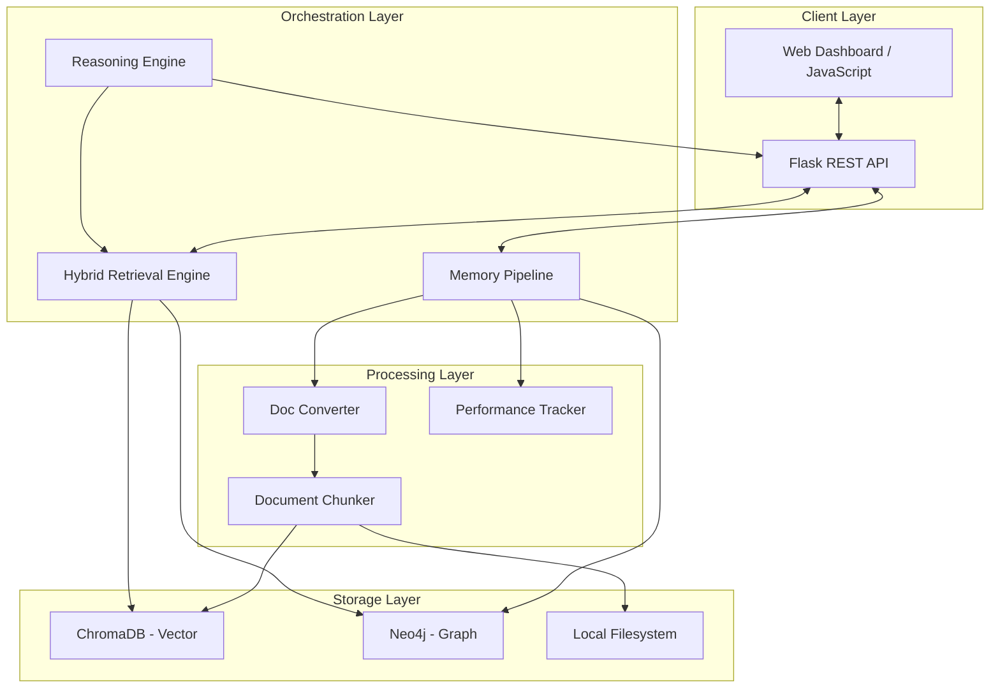
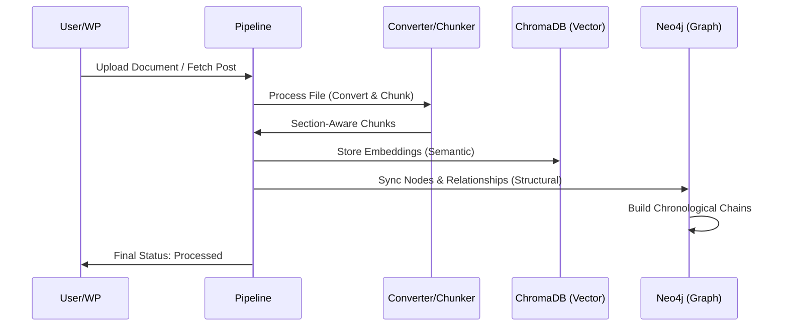
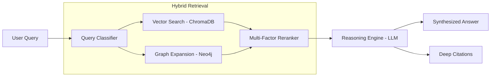

# Architectural Diagrams

This document visualizes the core architecture and data flows of the **AI Memory & Reasoning Agent**.

## 1. High-Level System Architecture
The system follows a modular, layered approach to separate concerns between data ingestion, storage, retrieval, and reasoning.

## 2. Data Ingestion Pipeline
How documents move from raw files to structured, searchable knowledge.

## 3. Hybrid RAG Retrieval Flow
The multi-stage process used to generate high-precision answers.

